# Row and Column classes

```
import 'dart:async';
import 'package:flutter/material.dart';
import 'package:flutter_test/flutter_test.dart';

class MyWidget extends StatelessWidget {
  @override
  Widget build(BuildContext context) {
    return Row(
      children: [
        BlueBox(),
        BlueBox(),
        BlueBox(),
      ],
    );
  }
}

class BlueBox extends StatelessWidget {
  @override
  Widget build(BuildContext context) {
    return Container(
      width: 50,
      height: 50,
      decoration: BoxDecoration(
        color: Colors.blue,
        border: Border.all(),
      ),
    );
  }
}
```

## Hasil
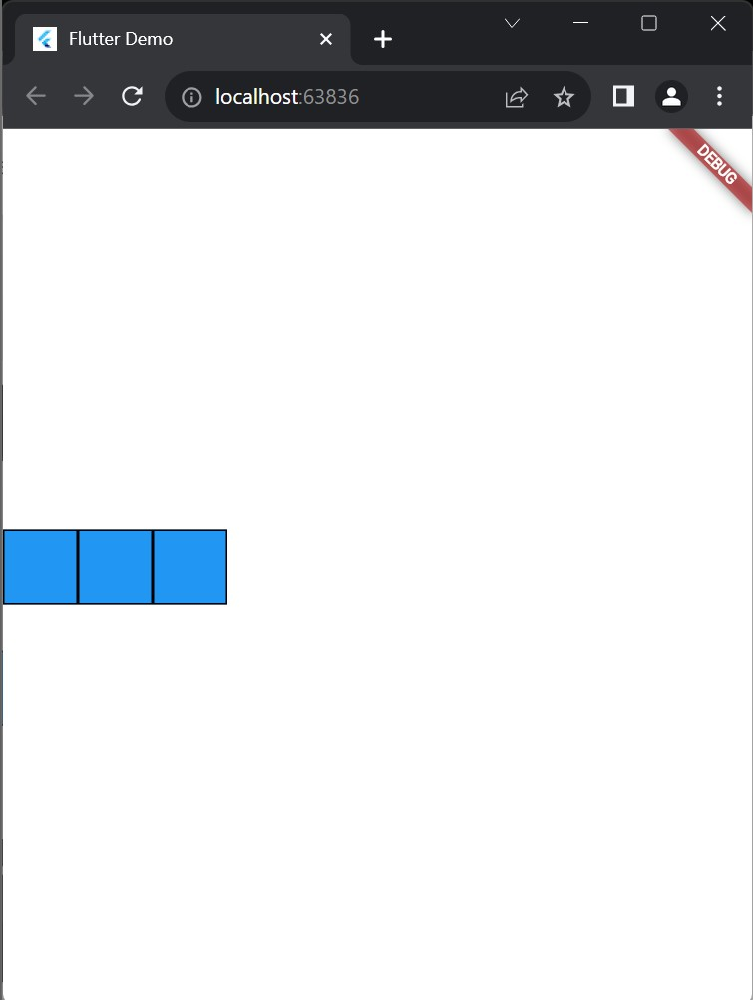

# Axis size and alignment

## 1. mainAxisSize property
```
import 'dart:async';
import 'package:flutter/material.dart';
import 'package:flutter_test/flutter_test.dart';

class MyWidget extends StatelessWidget {
  @override
  Widget build(BuildContext context) {
    return Row(
      mainAxisSize: MainAxisSize.max,
      children: [
        BlueBox(),
        BlueBox(),
        BlueBox(),
      ],
    );
  }
}

class BlueBox extends StatelessWidget {
  @override
  Widget build(BuildContext context) {
    return Container(
      width: 50,
      height: 50,
      decoration: BoxDecoration(
        color: Colors.blue,
        border: Border.all(),
      ),
    );
  }
}

```

## Hasil
## 1. MainAxisSize.max

## 2. MainAxisSize.min
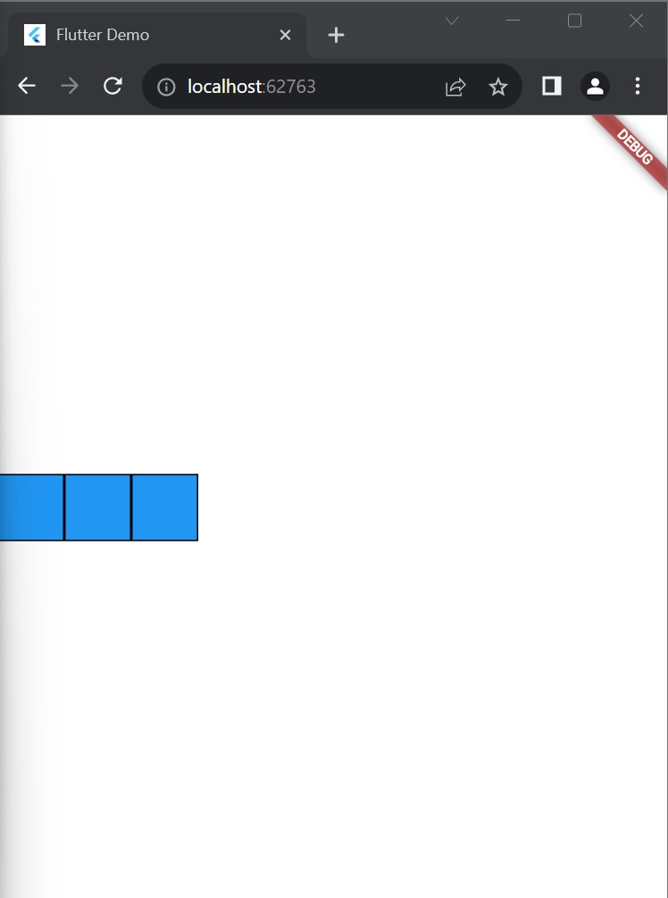

## mainAxisAlignment property
```
import 'dart:async';
import 'package:flutter/material.dart';
import 'package:flutter_test/flutter_test.dart';

class MyWidget extends StatelessWidget {
  @override
  Widget build(BuildContext context) {
    return Row(
      mainAxisAlignment: MainAxisAlignment.start,
      children: [
        BlueBox(),
        BlueBox(),
        BlueBox(),
      ],
    );
  }
}

class BlueBox extends StatelessWidget {
  @override
  Widget build(BuildContext context) {
    return Container(
      width: 50,
      height: 50,
      decoration: BoxDecoration(
        color: Colors.blue,
        border: Border.all(),
      ),
    );
  }
}
```
## Hasil
## 1. MainAxisAlignment.start

## 2. MainAxisAlignment.end
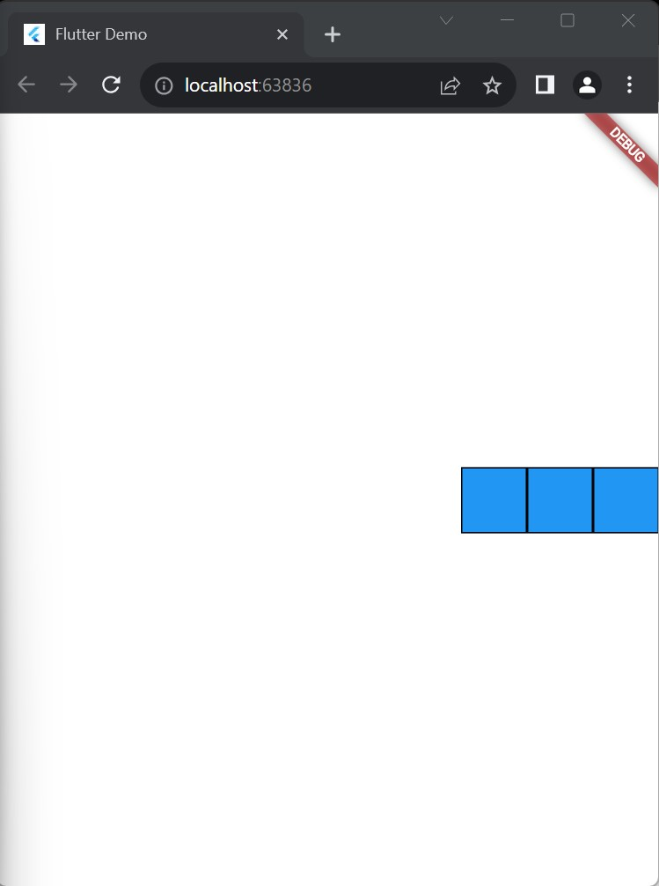
## 3. MainAxisAlignment.center
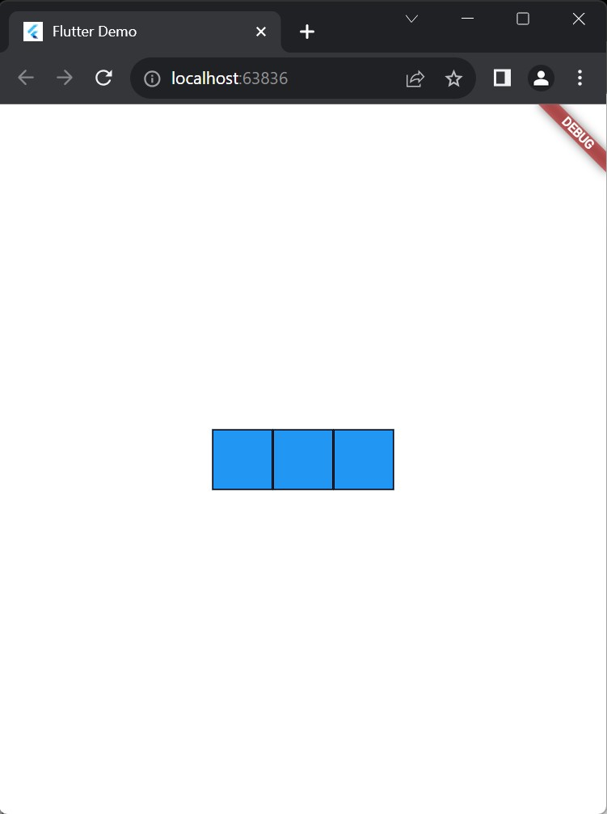
## 4. MainAxisAlignment.spaceBetween
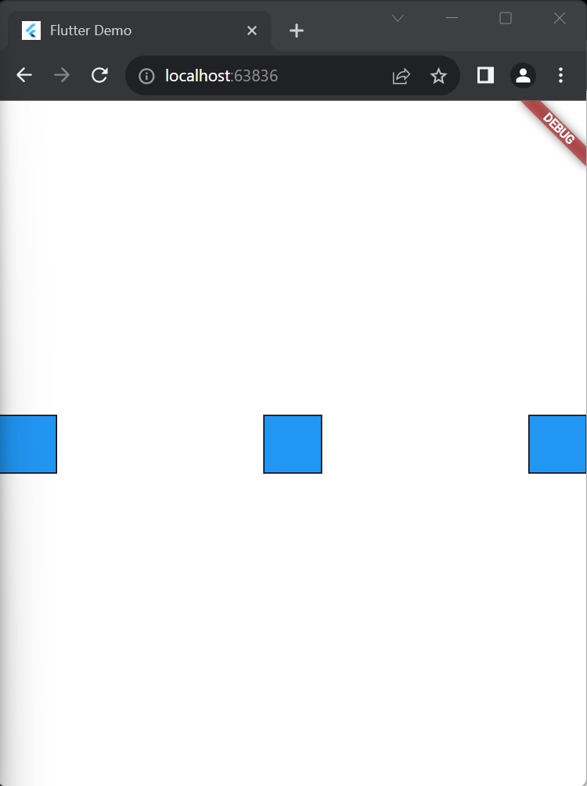
## 5. MainAxisAlignment.spaceEvenly
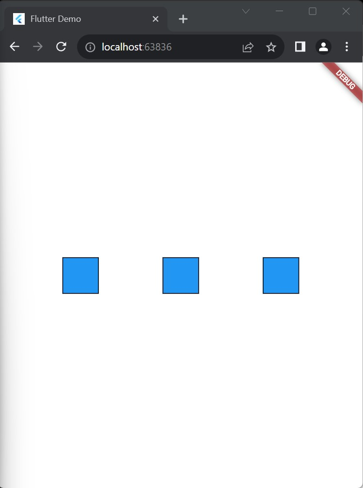

## crossAxisAlignment property
```
import 'dart:async';
import 'package:flutter/material.dart';
import 'package:flutter_test/flutter_test.dart';

class MyWidget extends StatelessWidget {
  @override
  Widget build(BuildContext context) {
    return Row(
      mainAxisAlignment: MainAxisAlignment.spaceAround,
      crossAxisAlignment: CrossAxisAlignment.center,
      children: [
        BlueBox(),
        BiggerBlueBox(),
        BlueBox(),
      ],
    );
  }
}

class BlueBox extends StatelessWidget {
  @override
  Widget build(BuildContext context) {
    return Container(
      width: 50,
      height: 50,
      decoration: BoxDecoration(
        color: Colors.blue,
        border: Border.all(),
      ),
    );
  }
}

class BiggerBlueBox extends StatelessWidget {
  @override
  Widget build(BuildContext context) {
    return Container(
      width: 50,
      height: 100,
      decoration: BoxDecoration(
        color: Colors.blue,
        border: Border.all(),
      ),
    );
  }
}
```
## Hasil
## 1. CrossAxisAlignment.start
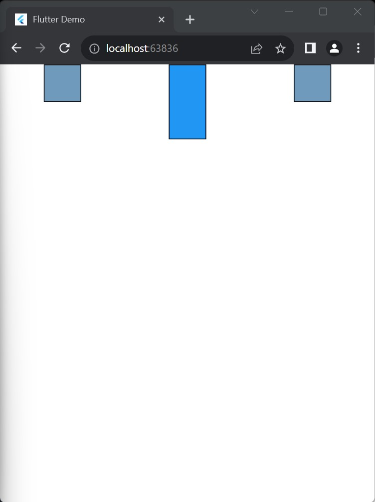
## 2. CrossAxisAlignment.end
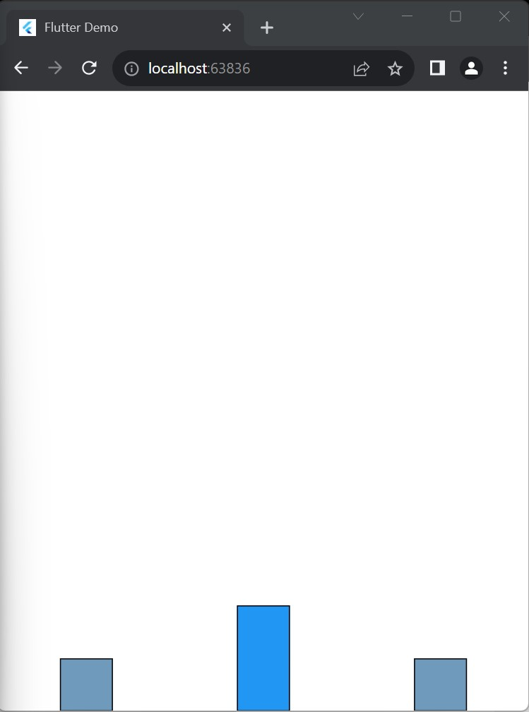
## 3. CrossAxisAlignment.center
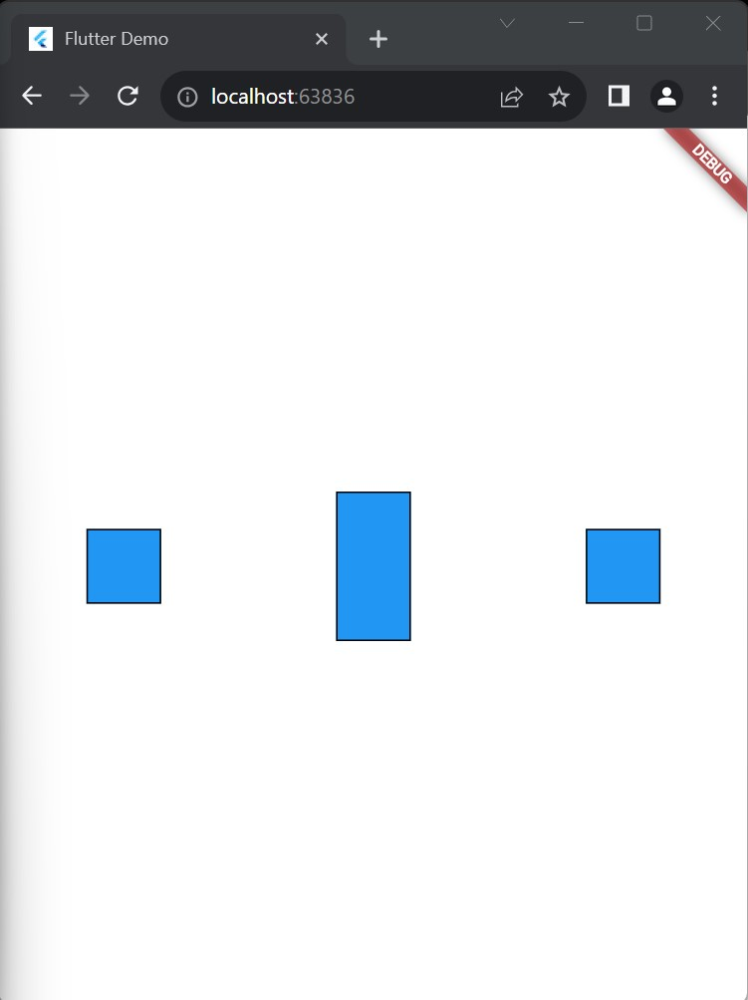
## 4. CrossAxisAlignment.stretch
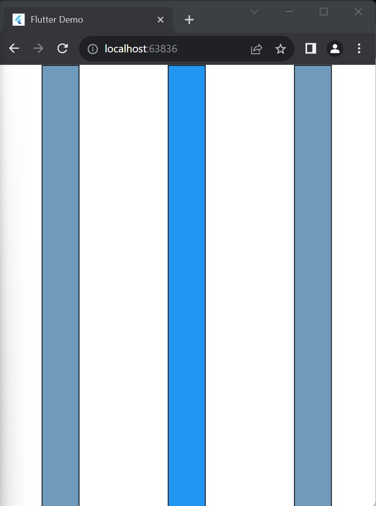

# Flexible widget
```
import 'dart:async';
import 'package:flutter/material.dart';
import 'package:flutter_test/flutter_test.dart';

class MyWidget extends StatelessWidget {
  @override
  Widget build(BuildContext context) {
    return Row(
      children: [
        BlueBox(),
        Flexible(
          fit: FlexFit.loose,
          flex: 1,
          child: BlueBox(),
        ),
        Flexible(
          fit: FlexFit.loose,
          flex: 1,
          child: BlueBox(),
        ),
      ],
    );
  }
}

class BlueBox extends StatelessWidget {
  @override
  Widget build(BuildContext context) {
    return Container(
      width: 50,
      height: 50,
      decoration: BoxDecoration(
        color: Colors.blue,
        border: Border.all(),
      ),
    );
  }
}
```

## Hasil
## 1. FlexFit.loose
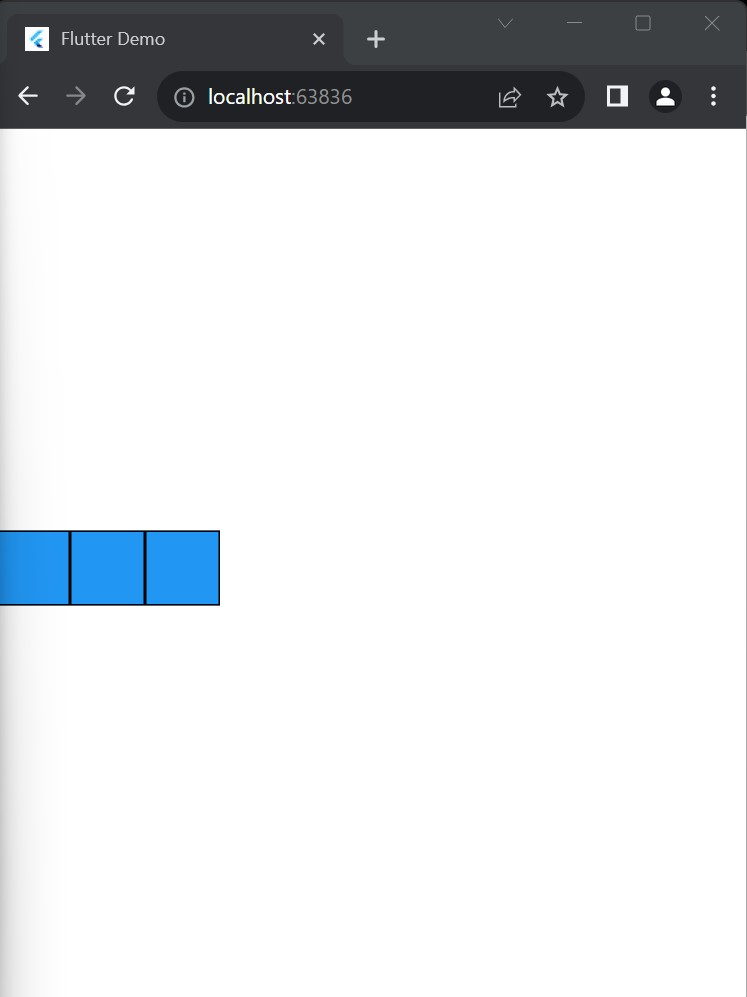
## 2. FlexFit.tight
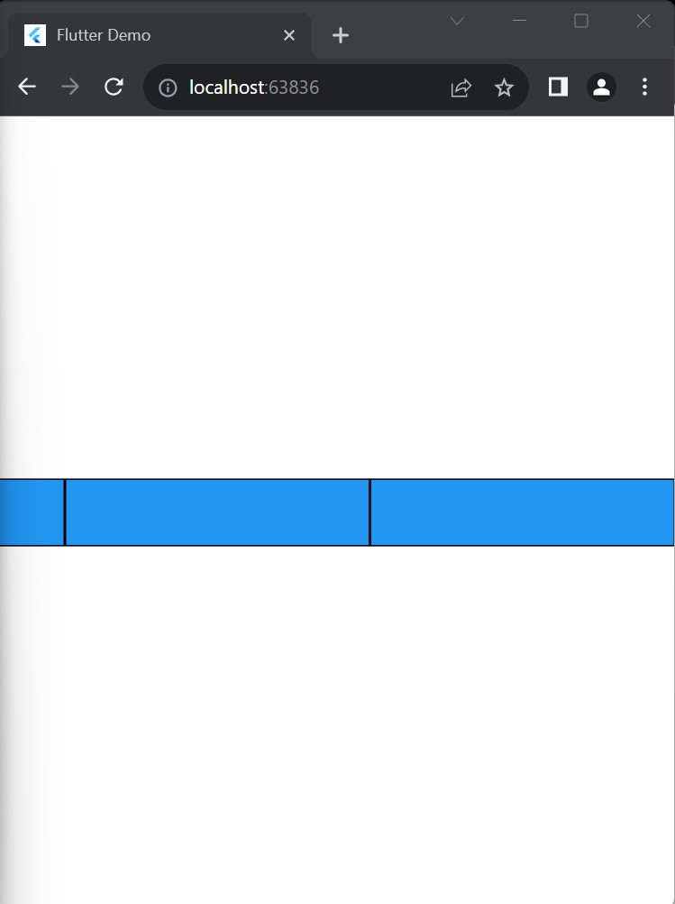
## 3. FlexFit.tight with flex:2


# Expanded widget
Wrap widget BlueBox kedua dalam expanded widget.
```
import 'dart:async';
import 'package:flutter/material.dart';
import 'package:flutter_test/flutter_test.dart';

class MyRowColumn extends StatelessWidget {
  const MyRowColumn({super.key});

  @override
  Widget build(BuildContext context) {
    return Row(
      children: [
        BlueBox(),
        Expanded(
          child: BlueBox(),
        ),
        BlueBox(),
      ],
    );
  }
}

class BlueBox extends StatelessWidget {
  @override
  Widget build(BuildContext context) {
    return Container(
      width: 50,
      height: 50,-
      decoration: BoxDecoration(
        color: Colors.blue,
        border: Border.all(),
      ),
    );
  }
}
```
## Hasil
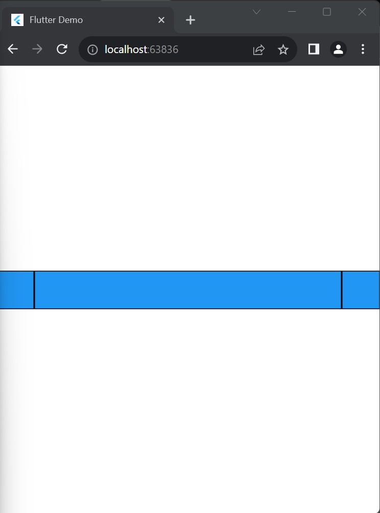

# SizedBox widget
Menambahkan Widget SizeBox pada method build(). Di sini kita dapat mengubah ukuran widget pada parameter width.
```
 Widget build(BuildContext context) {
    return Row(
      children: [
        BlueBox(),
        SizedBox(
          width: 100,
          child: BlueBox(),
        ),
        BlueBox(),
      ],
    );
  }
```
## Hasil
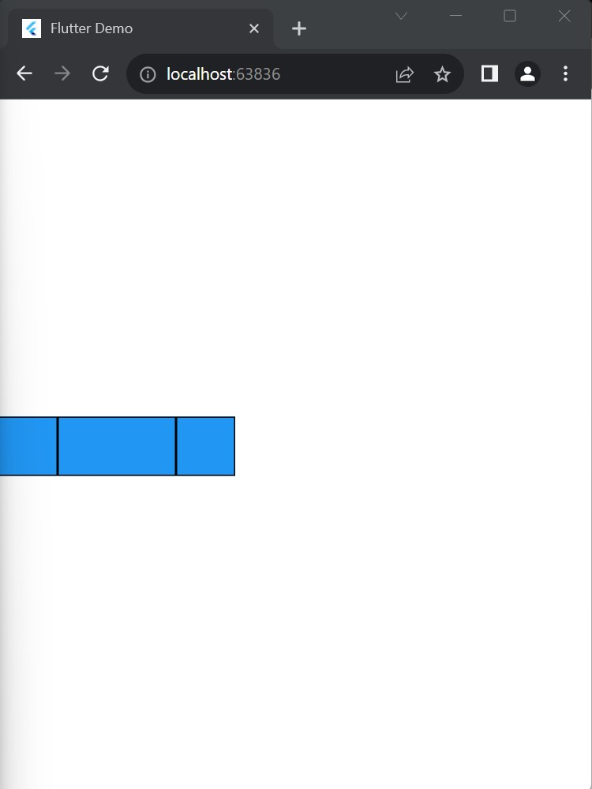

## Add another SizedBox widget (25 logical pixels wide) between the second and third BlueBox widgets
## Hasil


## Add another Spacer Widget

```
Widget build(BuildContext context) {
    return Row(
      children: [
        BlueBox(),
        const Spacer(flex: 1),
        BlueBox(),
        BlueBox(),
      ],
    );
  }
```
## Hasil
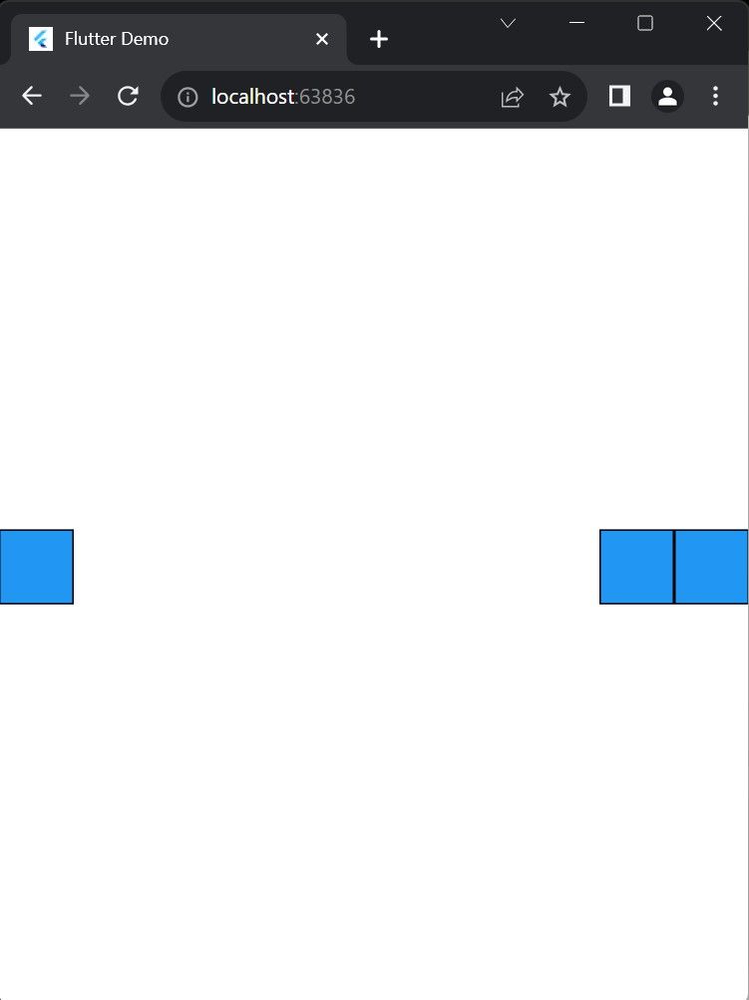

# Text widget
```
Widget build(BuildContext context) {
    return const Row(
      crossAxisAlignment: CrossAxisAlignment.center,
      textBaseline: TextBaseline.alphabetic,
      children: [
        Text(
          'Hey!',
          style: TextStyle(
            fontSize: 30,
            fontFamily: 'Futura',
            color: Colors.blue,
          ),
        ),
        Text(
          'Hey!',
          style: TextStyle(
            fontSize: 50,
            fontFamily: 'Futura',
            color: Colors.green,
          ),
        ),
        Text(
          'Hey!',
          style: TextStyle(
            fontSize: 40,
            fontFamily: 'Futura',
            color: Colors.red,
          ),
        ),
      ],
    );
  }
```
## Hasil
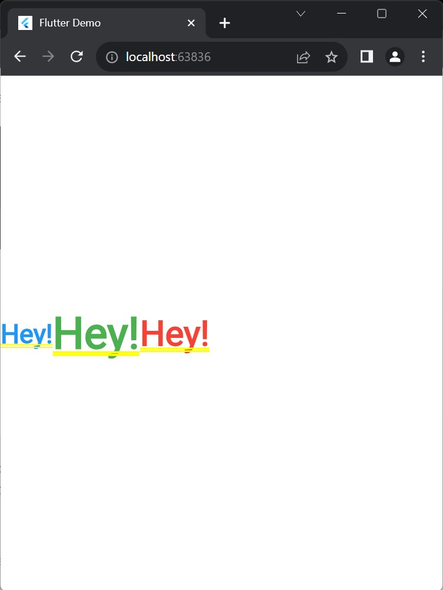

## Mengubah CrossAxisAlignment.center ke CrossAxisAlignment.baseline
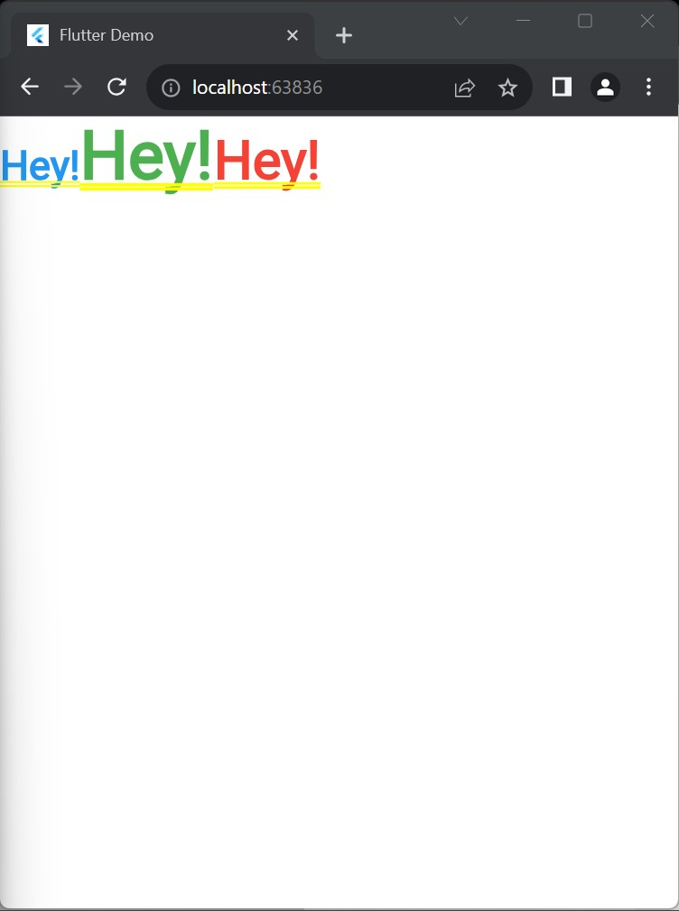

# Icon widget
```
 Widget build(BuildContext context) {
    return const Row(
      crossAxisAlignment: CrossAxisAlignment.center,
      textBaseline: TextBaseline.alphabetic,
      children: [
        Icon(
          Icons.widgets,
          size: 50,
          color: Colors.blue,
        ),
        Icon(
          Icons.widgets,
          size: 50,
          color: Colors.red,
        ),
      ],
    );
  }
```
## Hasil
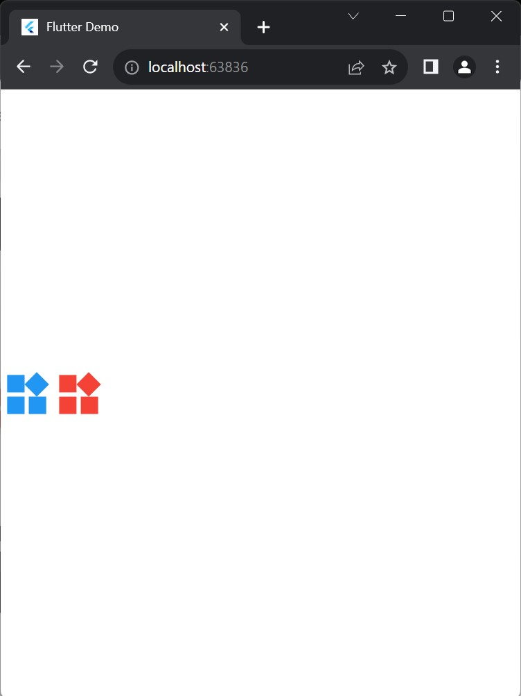

## Menambahkan satu icon dengan lebar 50 dan berwarna amber

```
Widget build(BuildContext context) {
    return const Row(
      crossAxisAlignment: CrossAxisAlignment.center,
      textBaseline: TextBaseline.alphabetic,
      children: [
        Icon(
          Icons.widgets,
          size: 50,
          color: Colors.blue,
        ),
        Icon(
          Icons.widgets,
          size: 50,
          color: Colors.red,
        ),
        Icon(
          Icons.widgets,
          size: 50,
          color: Colors.amber,
        ),
      ],
    );
  }
```

## Hasil


# Image widget

```
Widget build(BuildContext context) {
    return Row(
      mainAxisAlignment: MainAxisAlignment.center,
      children: [
        Image.network(
            'https://upload.wikimedia.org/wikipedia/id/thumb/d/d8/Lambang_Partai_Demokrasi_Indonesia_Perjuangan.svg/270px-Lambang_Partai_Demokrasi_Indonesia_Perjuangan.svg.png'),
      ],
    );
  }
```

## Hasil
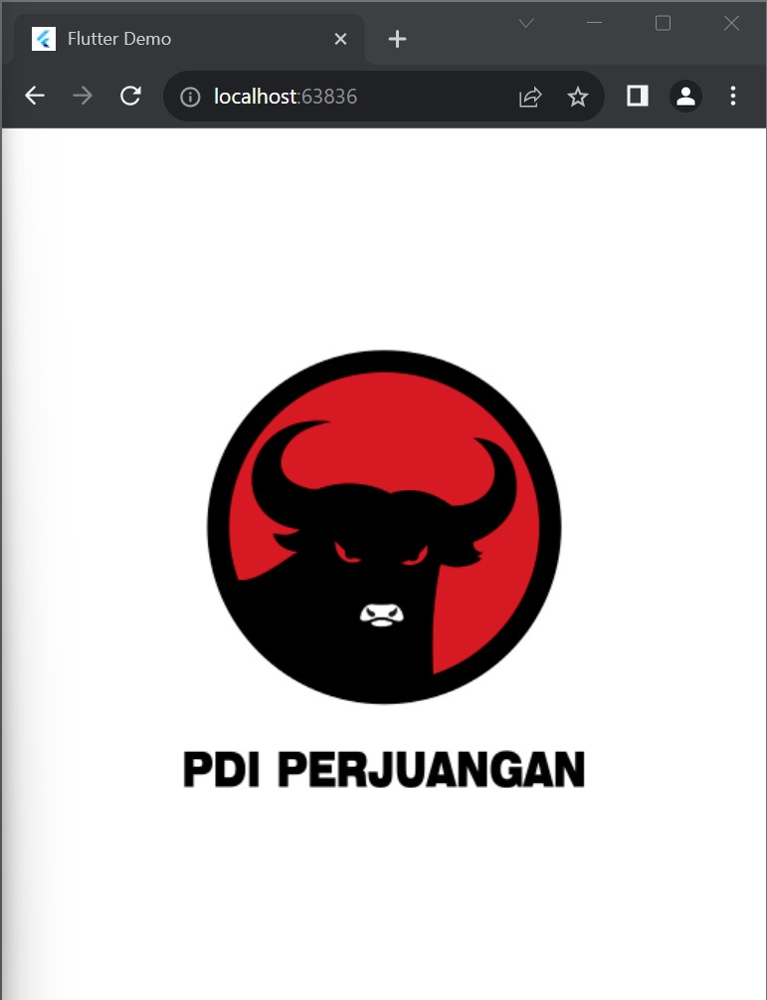

